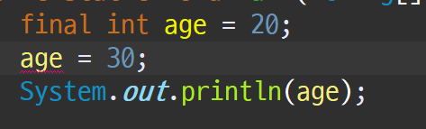

# 3. 자바의 자료형의 종류

| 자료형 | 키워드        |크기|기본값|표현되는 값의 범위|
|-----|------------|---|---|---|
| 논리형 | boolean    |1bit|false|true 또는 false(0또는1)|
| 문자형 | char       |2byte|\u0000|0~65,535|
| 정수형 | byte       |1byte|0|-128 ~ 127|
|     |  short     |2byte|0|-32768~ 32767|
|     | int(기본)    |4byte|0|-2147483648 ~ 2147483647|
|     | long       |8byte|0|-9223372036854775808 ~ 9223372036854775807|
| 실수형 | float      |4byte|0.0|-3.4E38 ~ +3.4E38|
|     | double(기본) |8byte|0.0|-1.7E308 ~ +1.7E308|

---

## 상수와 리터럴

- 상수란: 항상 변하지 않는 값, 상수는 자료형 앞에 final을 붙여 표현하며, 항상 대문자 변수명을 사용한다.

</br>

🔥 특징
1. 상수는 초기화가 이루어진 이 후에는 새로 초기화해서 사용할 수 없다.
2. 상수는 선언을 하였으면 무조건 초기화 해야한다.



</br>

- 리터럴이란: 기본적으로 컴퓨터 안에 정해져 있는 숫자나, 글자의 의미의 값을 의미한다.

</br>

- 예를 들어 100이라는 숫자나 '홍길동' 이라 던지  </br>
cat 이런 것들은 의미가 있는 애들을 컴퓨터가 지정해서 이러한 의미라고 정해놓은 애들이다.

</br>

🔥 이러한 리터럴 상수가 있음으로 인해서 우리가 변수를 선언 할 때에 일일이 2진수로 </br>
변환하여 쓸 필요가 없는 것이다.

---

# 형 변환

</br>

- 형 변환: 위에서 알아본 자료형을 다른 자료형으로 변환을 하는 것을 의미한다.

> 이 형 변환에는 업캐스팅과 다운캐스팅이 존재한다.

</br>

- 업캐스팅 : 값이 작은 범위에서 큰 범위로의 형변환을 의미한다.

> 작은 곳에서 큰 곳으로 가기 때문에 묵시적으로 형 변환이 가능하다 (형 변환 타입을 생략 가능하다.)

</br>

- 예시 코드를 보며 확인하기

```java
public class Casting1 {
	public static void main(String[] args) {
		char a = 'a';
		int num1 = a; // 묵시적 형 변환
		
		System.out.println((double)a);
		System.out.println((char)97.0);
		System.out.println((byte)300); // 256까지 절대 값으로 표현 할 수 있기에 그 것이 넘어간 후에는 0으로 다시시작 그래서 44라는 값이 나온다
		// 보수 개념 알아야함
	}
}

```

</br>


- 다운 캐스팅: 큰 것을 작은 것으로 변환하는 것.

> 큰 것에서 작은 곳으로 가기 때문에 무조건 타입을 명시 해주어야 한다.

</br>

- 예시 코드를 보며 이해하기

```java
public class Casting2 {
	public static void main(String[] args) {
		char char_a = 'a';
		int num = (int)char_a; // (int) 생략가능 묵시적 형 변환 업캐스팅 상위의 자료형으로 변환
		
		char char_b = (char) (num + 1); // 다운 캐스팅 상위의 자료형이 하위로 내려가는 변환 무조건 명시적 형 변환
		System.out.println(char_b);
	}
}
```