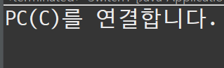

# 5. 제어문

## 조건문

### if, else, else if

- if: 만약 ~ 라면 (조건은 if에만 달린다.) 조건절 뒤에는 명령절이 오게된다.
- else: if의 조건이 아니면 ~

> 특징: else 와 if 는 **하나의 명령**만을 실행할 수 있고 **여러가지의 명령**을 주기 위해서는
> **범위를 지정** 해주어야 한다. { } 를 통해서 범위를 지정해주게 되면 여러가지의 명령을 줄 수 있다.
> 그리고 if 나 else 뒤에 **또 다른 if else 가 올 수 있으며** else 만 **단독**으로 사용 불가하다.

---

```java
Scanner sc = new Scanner(System.in);

int score = 0;
String grade = null;
		
System.out.print("점수 입력: ");
score = sc.nextInt();

if(score < 0 || score > 100) {
	grade = null;
}else if (score > 89) {
	grade = "A";
}else if (score > 79) {
	grade = "B";
}else if (score > 69) {
	grade = "C";
}else if (score > 59) {
	grade = "D";
}else {
	grade = "F";
}

if((score > 59 && score < 101) && (score % 10 > 4 || score == 100)) {
	grade += "+";
}

if(grade == null) {
	System.out.println("계산 불가");
}else {
	System.out.println("점수(" + score + "): " + grade + "학점");
}
```

</br>

- 실습 코드 결과 콘솔 화면


---

### switch / case 문
- switch ~ case : 해당 조건에 맞는 case를 찾는 문법이다.

- default : if문의 else와 같은 문법

- 실습예제 코드
```java
String select = "C선택";
		
switch (select) {
	case "A선택" :
		System.out.println("PC(A)를 연결합니다.");
		break;
	case "B선택" :
		System.out.println("PC(B)를 연결합니다.");
		break;
	case "C선택" :
		System.out.println("PC(C)를 연결합니다.");
		break;
	case "D선택" :
		System.out.println("PC(D)를 연결합니다.");	
		break;
	default :
		System.out.println("else와 같은 역할");
}
```

- 실습 코드 예제 콘솔 화면 </br></br>


